## Dalla teoria alle decisioni di portafoglio

Esperimento pubblico Jensen-Kelly-Pedersen | 5 settembre 2026

La conclusione utile non è scegliere sempre il modello più flessibile. È distinguere quale rappresentazione funziona, quanta complessità attivare e quanto sia stabile il valore attribuito alle singole caratteristiche.

Analisi eseguita: 153 portafogli caratteristici USA, 47 specificazioni selezionate, 584 punti sulle traiettorie di regolarizzazione e 153 rimozioni individuali sulla sola validation. Test separato: 252 mesi, gennaio 2005-dicembre 2025.

| Policy | C | SR val. | SR test | Media ann. | Vol. ann. |
|---|---|---|---|---|---|
| Statico regolarizzato | 24 | 3.132 | 1.243 | 3.10% | 2.49% |
| Matérn completo | 48 | 0.672 | 0.698 | 4.18% | 5.99% |
| Top 8 | 4 | 1.583 | 0.495 | 4.69% | 9.48% |

Tre decisioni suggerite dall'evidenza. Mantenere un benchmark statico regolarizzato serio. Non eliminare caratteristiche solo per comprimere la libreria. Non usare il migliore Sharpe di test come regola di scelta: la biblioteca top-8 vince sulla validation ma non nel test successivo.

Perimetro: questi sono rendimenti pubblici di portafogli long-short costruiti sulle caratteristiche JKP. Non sono il pannello azionario CTF, non sono una submission al leaderboard e non permettono di ricostruire costi o posizioni sui singoli titoli. I risultati precedenti nei PDF del progetto non sono usati come dati di questo esperimento. [1,2]

La parola complessità indica soltanto C, la effective dimension dei managed payoffs. Il numero di caratteristiche e la dimensione nominale della rappresentazione restano oggetti distinti. [3,4]

## 1. Che cosa è stato effettivamente stimato

| Fase | Periodo e decisione |
|---|---|
| Dati | Serie USA ufficiali JKP; variante principale capped-value-weighted; valori già orientati long-short dagli autori. |
| Calibrazione | Gennaio 1973-dicembre 1994: copertura della biblioteca, scala degli stati e lunghezza del kernel. |
| Validation | Gennaio 1995-dicembre 2004: scelta di C, ranking delle caratteristiche e numero di caratteristiche. |
| Test | Gennaio 2005-dicembre 2025: solo valutazione delle scelte bloccate. |
| Ristima | Mensile, ultimi 120 mesi; sensitività 60 e 240 mesi sulle stesse date di valutazione. |

Gli stati sono le medie e volatilità mobili a 12 mesi dei rendimenti di sette gruppi bibliografici, ritardate di un mese: 14 coordinate. Non sono le 13 categorie empiriche stimate da JKP. Nessun rendimento del mese corrente entra nella decisione di quel mese.

Nucleo statistico: G_ts = K(Z_t,Z_s) R_t'R_s / T; C(lambda) = tr[G(G + lambda I)^(-1)]. Il livello lambda si trova usando soltanto gli autovalori del training, per raggiungere un budget C prefissato. È una procedura empirica data-dependent, non uno stimatore dei parametri strutturali b e r.

Controllo del rischio: obiettivo ex ante 10% annuo, covarianza con 10% di shrinkage verso la diagonale e somma dei pesi assoluti sui fattori non superiore a tre. Il vincolo può impedire di raggiungere il 10%. La loss nativa è calcolata prima di questo scaling; C descrive il nucleo stimato, non ogni proprietà della policy finale.

Vincolo storico: la libreria completa è retrospettiva e contiene anche lavori pubblicati dopo il 2004. La sensitività su 57 caratteristiche pubblicate entro il 2004 limita questo problema, ma non ricostruisce una vintage storica dei dati. [1]

## 2. Quale rappresentazione regge fuori campione?

| Policy | C | SR val. | SR test | Media ann. | Vol. ann. |
|---|---|---|---|---|---|
| Statico regolarizzato | 24 | 3.132 | 1.243 | 3.10% | 2.49% |
| Matérn completo | 48 | 0.672 | 0.698 | 4.18% | 5.99% |
| Lineare | 16 | 2.140 | 0.616 | 4.30% | 6.98% |
| Gaussiano | 0.5 | 0.587 | 0.476 | 5.00% | 10.51% |
| Allocazione uniforme | nan | 0.674 | 0.465 | 3.31% | 7.11% |

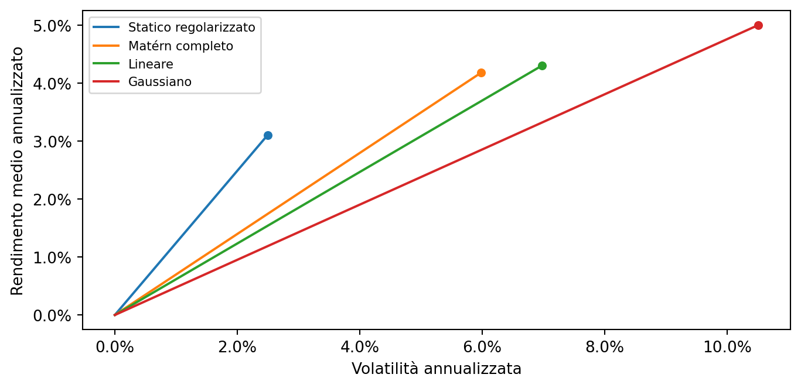

Il kernel costante corrisponde a una combinazione di fattori senza timing nonlineare degli stati, ma con pesi ristimati ogni mese. Qui offre Sharpe maggiore del Matérn. Non lo domina in ogni unità economica: il Matérn produce media e certainty equivalent realizzati maggiori, con maggiore volatilità.

CE annuale mean-variance, gamma=5: Matérn 3.28%, statico 2.95%. I segmenti del grafico arrivano al rischio effettivamente osservato; non estrapolano il portafoglio statico al 10% violando il vincolo sui pesi.

La differenza Sharpe Matérn meno statico è -0.545. Il paired block bootstrap a 12 mesi produce un intervallo 95% [-1.024; -0.049]. È inferenza condizionata alle specificazioni selezionate, non una garanzia di dominanza futura. [File: paired_inference.csv]

## 3. Complessità: beneficio, limite e incertezza

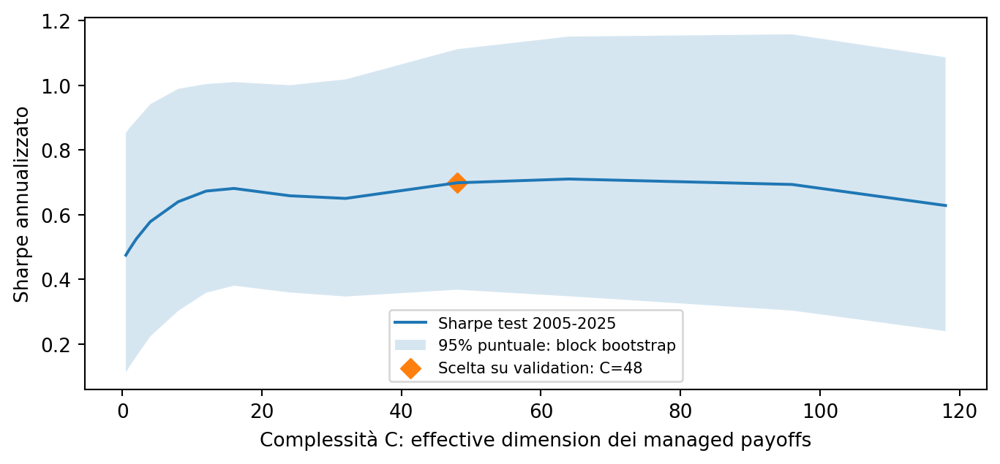

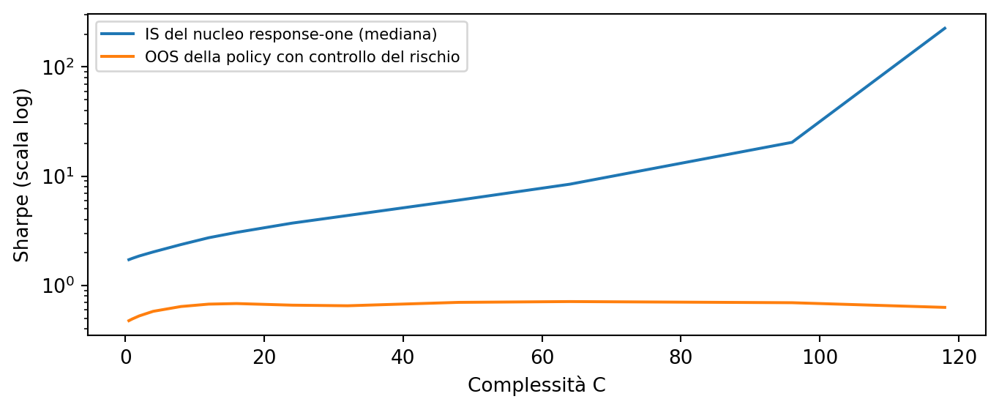

La validation sceglie C=48: Sharpe test 0.698. Il massimo descrittivo del test è C=64, Sharpe 0.710: non viene usato per cambiare la scelta. A C=118 lo Sharpe test è 0.628, mentre lo Sharpe IS mediano del nucleo è 226.0. Non emerge il collasso generalizzato suggerito dalle illustrazioni precedenti.

La banda è puntuale, al 95%, da blocchi circolari di 12 mesi. Non include nuova selezione del modello o ristima in ciascun bootstrap. Il confronto IS/OOS distingue il fit del nucleo response-one dalla performance della policy con il controllo causale del rischio. Non dimostra una forma universale della curva. [3,4,5]

## 4. Il valore della storia di mercato

| Training (mesi) | C scelta | SR validation | SR test | lambda medio |
|---|---|---|---|---|
| 60 | 32 | 0.695 | 0.646 | 0.000391 |
| 120 | 48 | 0.672 | 0.698 | 0.000438 |
| 240 | 64 | 0.645 | 0.953 | 0.000493 |

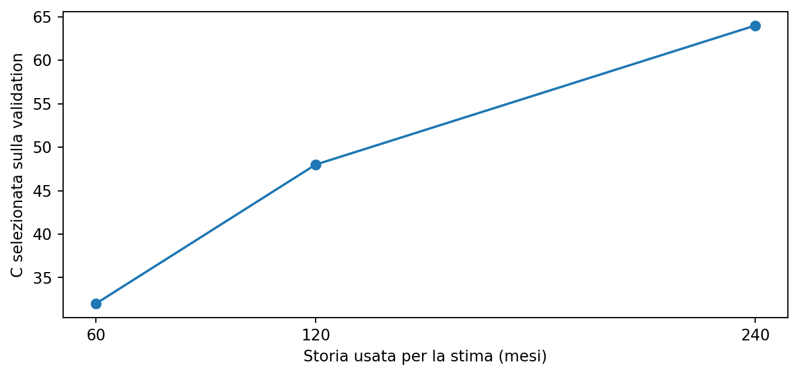

In questo esperimento, più storia sostiene una complessità selezionata maggiore: 32, 48, 64. Il Matérn con 240 mesi migliora lo Sharpe test rispetto alle finestre da 60 e 120 mesi, e riduce la riallocazione media mensile dei fattori da circa 0.874 a 0.480.

Non tutto conferma la legge asintotica. Il lambda medio cresce leggermente anziché diminuire. Qui la griglia è in C e lambda è invertito su spettri campionari diversi; b e r sono ignoti. Questi numeri non identificano gli esponenti teorici e non sono una validazione quantitativa della legge di regolarizzazione.

Decisione operativa da sottoporre a nuova verifica: scegliere congiuntamente finestra e C su validation temporale, conservando un test ulteriore. Non adottare automaticamente 240 mesi perché è il migliore dei tre nel test già osservato.

## 5. Quali gruppi di caratteristiche servono?

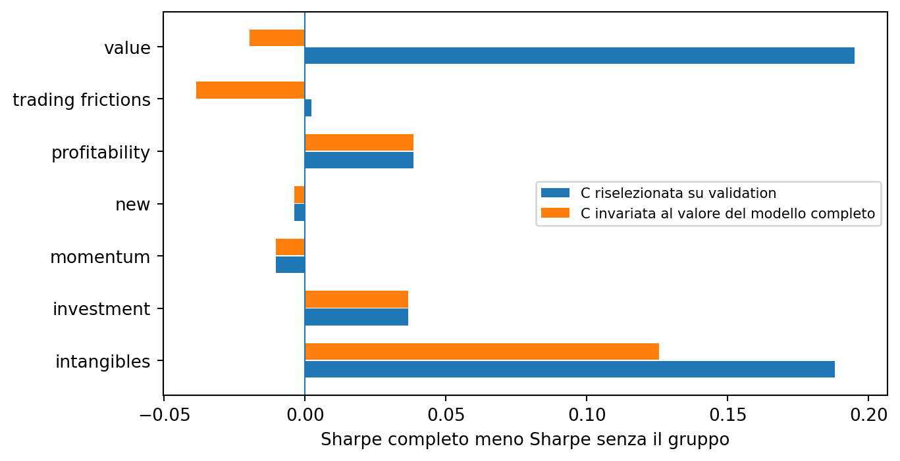

Per ogni gruppo vengono eliminati i relativi portafogli, lasciando invariati gli stati. La differenza di Sharpe è misurata sia mantenendo C=48 sia scegliendo di nuovo C sulla validation. Positivo significa che la rimozione peggiora il risultato.

Esempio decisivo: value. Con C riselezionata la rimozione costa 0.195 punti di Sharpe nel test. A C invariata, la differenza è -0.020. Non sarebbe corretto attribuire tutta la prima differenza al contenuto economico di value: cambia anche la regolarizzazione scelta.

Il gruppo intangibles mostra contributi positivi in entrambi i confronti nei point estimates, ma gli intervalli simultanei al 95% non escludono zero per nessuno dei gruppi. Le correlazioni fra caratteristiche impediscono di interpretare la rimozione come un effetto causale isolato.

Uso pratico: confrontare contributo marginale, sensibilità a C e incertezza prima di eliminare un gruppo. La sparsità della lista di caratteristiche non coincide con una piccola complessità del portafoglio, distinzione centrale anche in Kozak-Nagel-Santosh. [3]

## 6. Le caratteristiche selezionate prima del test

| # | Codice JKP | Significato | Anno | Delta SR val. |
|---|---|---|---|---|
| 1 | ret_12_7 | Momentum dei mesi 12-7 | 2012 | 0.0262 |
| 2 | resff3_12_1 | Momentum residuo 12-1 | 2011 | 0.0187 |
| 3 | ival_me | Valore intrinseco / mercato | 1998 | 0.0155 |
| 4 | eq_dur | Duration azionaria | 2004 | 0.0135 |
| 5 | fcf_me | Free cash flow / prezzo | 1994 | 0.0128 |
| 6 | ebitda_mev | EBITDA / enterprise value | 2011 | 0.0125 |
| 7 | rd_me | R&D / valore di mercato | 2001 | 0.0124 |
| 8 | seas_2_5an | Stagionalità annuale, anni 2-5 | 2008 | 0.0112 |

Ranking ottenuto eliminando una caratteristica alla volta e riselezionando C sulla sola validation. Delta SR = Sharpe completo meno migliore Sharpe dopo la rimozione. Il file completo contiene anche il confronto a C invariata e il ranking basato sul solo Sharpe individuale.

Questa è una shortlist di ricerca, non una lista dimostrata di alpha indispensabili. Alcune pubblicazioni sono posteriori al 2004: non erano una selezione conoscibile all'inizio del test. Inoltre, i controlli successivi sulle prime dieci caratteristiche non mostrano contributi individuali diversi da zero nelle bande simultanee al 95%.

La domanda qui è quali portafogli caratteristici includere nell'allocazione. La domanda distinta, quali variabili grezze inserire nella funzione dei pesi azionari, richiede il pannello CTF. I due problemi non sono intercambiabili. [1,2]

## 7. La sparsità selezionata non vince il test

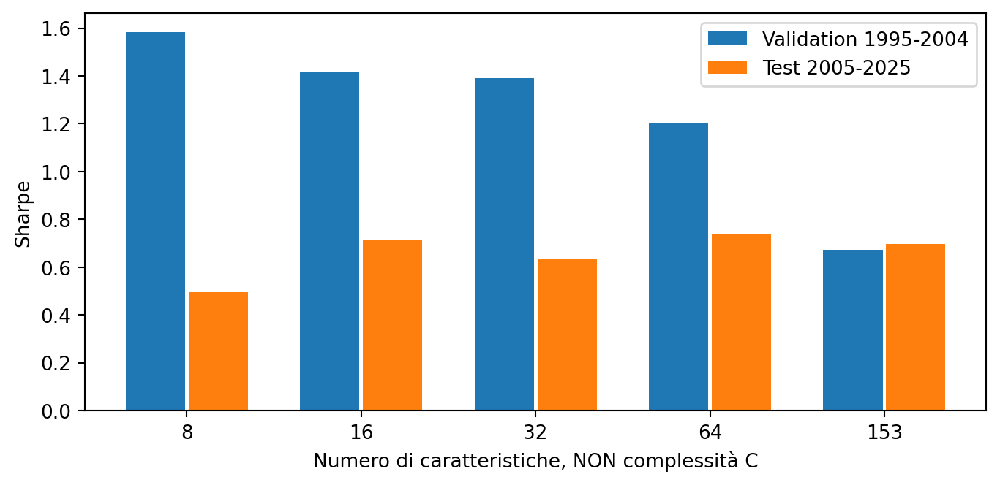

| Policy | C | SR val. | SR test | Media ann. | Vol. ann. |
|---|---|---|---|---|---|
| Top 8 | 4 | 1.583 | 0.495 | 4.69% | 9.48% |
| Top 16 | 24 | 1.419 | 0.712 | 6.15% | 8.64% |
| Top 32 | 32 | 1.391 | 0.637 | 5.12% | 8.05% |
| Top 64 | 32 | 1.204 | 0.740 | 5.38% | 7.28% |
| Matérn completo | 48 | 0.672 | 0.698 | 4.18% | 5.99% |

La stessa validation sceglie la dimensione della libreria: vince compact_top8 con Sharpe 1.583. Nel test arriva a 0.495, contro 0.698 della libreria completa regolarizzata. Scegliere un altro numero di caratteristiche dopo aver visto il test significherebbe usarlo per fare model selection.

Le librerie compatte ricostruiscono anche gli stati usando soltanto le caratteristiche trattenute. Il confronto misura quindi una scelta completa di rappresentazione, non il solo effetto meccanico del numero di fattori.

Conseguenza: non vedo evidenza sufficiente per sostituire automaticamente la biblioteca ampia con la shortlist. Meglio tenere entrambe come strategie concorrenti bloccate e confrontarle in un periodo non ancora utilizzato. La regolarizzazione e la selezione dura di caratteristiche risolvono problemi diversi. [3,4]

## 8. Quali informazioni inserire negli stati?

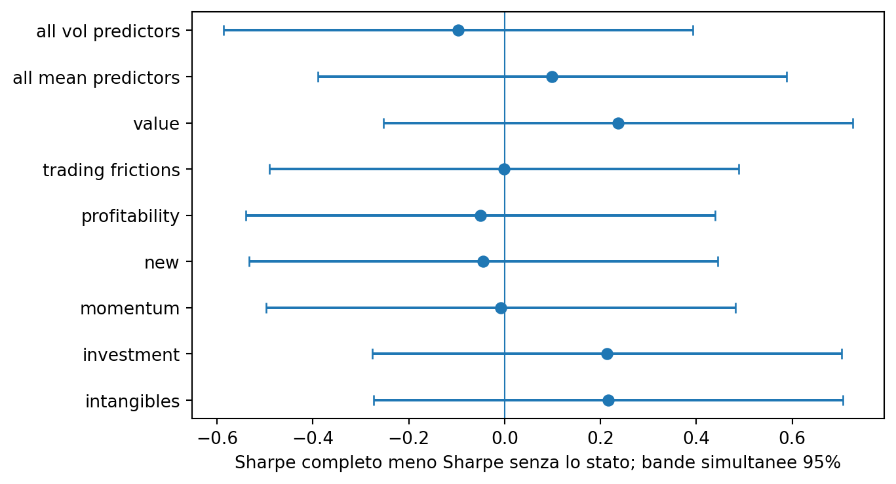

Qui l'universo investibile resta composto da tutti i 153 fattori. Si rimuovono invece le due coordinate di un gruppo dagli stati, oppure tutte le medie o tutte le volatilità. Il kernel mantiene la calibrazione pre-validation; C viene riselezionata.

Le bande simultanee non sostengono una conclusione forte su un singolo gruppo. Nei point estimates, eliminare le volatilità porta lo Sharpe test a circa 0.795, ma questo non autorizza a scegliere retroattivamente quella specificazione. Eliminare gli stati value porta invece a circa 0.462.

Il test utile per il paper non è soltanto una classifica di feature importance: è capire se un'informazione serve come segnale di timing, come investimento da detenere o come copertura. Queste prove isolano almeno le prime due funzioni. Per distinguere premi, rischio e costi a livello azionario servono dati e controlli ulteriori. [3,6]

## 9. I costi possono cambiare la scelta, ma quali costi?

| Addebito (bps) | C scelta | SR test dopo proxy | CE gamma=5 |
|---|---|---|---|
| 0 | 48 | 0.698 | 3.28% |
| 10 | 48 | 0.559 | 2.45% |
| 25 | 1 | 0.337 | 0.79% |
| 50 | 1 | 0.181 | -0.84% |

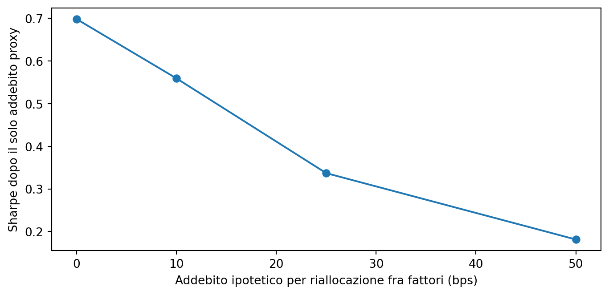

L'addebito è la tariffa ipotetica moltiplicata per la somma delle variazioni assolute dei pesi fra portafogli caratteristici. Con 25 o 50 bps, la validation passa da C=48 a C=1. Questo mostra che il criterio netto può preferire un uso diverso della rappresentazione.

Non è un backtest netto azionario. Mancano il turnover interno dei fattori, i costi dei titoli, il netting delle operazioni fra strategie, il prestito titoli, lo spread e il price impact. Questa proxy non è né una stima completa né necessariamente un limite inferiore ai costi reali.

La complessità non misura automaticamente turnover o capacità. Il passaggio alla frontiera implementabile richiede holdings e trades reali, come nel problema di Jensen-Kelly-Malamud-Pedersen. La regressione quadratica di base non si estende a costi nonlineari semplicemente sostituendo i rendimenti con quelli netti. [7]

## 10. Dimensione nominale: il plateau non è provato

| Feature RFF P | Parametri 153P | C scelta | SR test |
|---|---|---|---|
| 16 | 2448 | 8 | 0.464 |
| 64 | 9792 | 24 | 0.552 |
| 256 | 39168 | 64 | 0.644 |
| 1024 | 156672 | 118 | 0.540 |

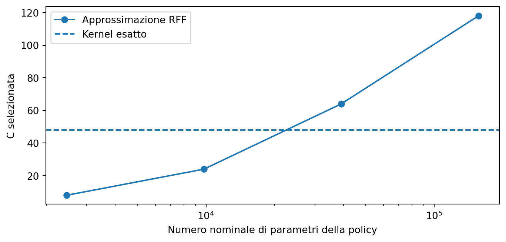

Le approssimazioni usano prefissi della stessa estrazione di frequenze. Aumentando P la complessità selezionata varia da 8 a 118 e lo Sharpe test non converge monotonicamente al kernel esatto. In questa griglia e con questo seed non emerge il plateau stabile anticipato nelle precedenti illustrazioni.

Il fatto che i parametri nominali siano molti più di C resta vero per definizione e per i valori osservati. Non basta, però, per certificare che l'approssimazione abbia recuperato la stessa regola economica. Servono più accuratezza e più seed, da trattare come nuova robustness e non da selezionare sul test corrente. [4,5]

## 11. Dove sta il rendimento nel sistema spettrale?

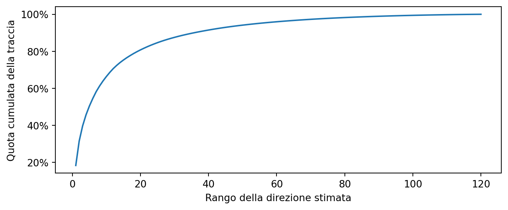

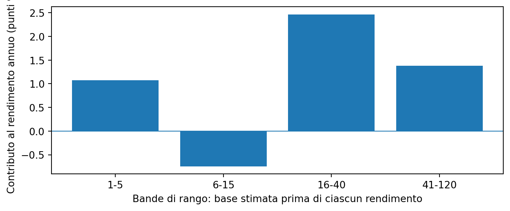

I primi cinque ranghi spiegano il 50.4% della traccia media di training; i primi quindici il 75.3%. I contributi al rendimento OOS annuo delle quattro bande sono +1.08, -0.74, +2.47, +1.38 punti percentuali. La loro somma ricostruisce il rendimento della policy.

La base è stimata prima di ciascun payoff. Le bande raggruppano ranghi mobili, non necessariamente gli stessi fattori economici nel tempo. Questi contributi sono firmati e possono essere negativi: non sono quote del vero segnale, contributi separabili allo Sharpe o una stima di r. Mostrano perché sola varianza spiegata e solo conteggio delle caratteristiche non bastano. [3,4]

## 12. Robustezza, interpretazione e decisione finale

| Policy | C | SR val. | SR test | Media ann. | Vol. ann. |
|---|---|---|---|---|---|
| Matérn completo | 48 | 0.672 | 0.698 | 4.18% | 5.99% |
| Matérn: value-weighted | 64 | 0.814 | 0.672 | 4.32% | 6.42% |
| Matérn: equal-weighted | 48 | 1.765 | 1.575 | 10.05% | 6.38% |
| Pubblicate entro il 2004 | 32 | 0.768 | 0.568 | 4.37% | 7.70% |
| Biblioteca finanziaria predefinita | 4 | 1.054 | 0.393 | 3.91% | 9.96% |

La variante equal-weighted ha Sharpe test circa 1.575, molto maggiore della capped-value-weighted principale. È una sensitività cruciale, non il nuovo headline da scegliere dopo il test. Potrebbe riflettere differenze nella composizione e negoziabilità, ma qui non abbiamo i titoli per identificarne la causa.

Che cosa farei con questi risultati: mantenere la libreria ampia con shrinkage e un benchmark statico regolarizzato; trattare la shortlist come concorrente da verificare, non come lista da adottare; scegliere finestra e C prima del test; valutare ogni esclusione sia a C invariata sia con nuova regolarizzazione.

Che cosa non farei: promettere un massimo universale di Sharpe, stimare b o r da queste poche finestre, presentare segmenti di rischio-rendimento stimati come distanze note dalla frontiera di popolazione, oppure chiamare netti i risultati con il solo addebito proxy.

L'evidenza pratica più forte è che la representation e la selezione delle caratteristiche contano quanto la regolarizzazione. Questa analisi non incorona un kernel. Fornisce un protocollo e risultati controllabili per separare apprendimento, selezione, scala e costi.

## 13. Replica, limiti e collegamento con la letteratura

Replica: fetch_public.py scarica i file ufficiali con SHA256 e provenienza; engine.py costruisce stati e policy causali; run_study.py esegue le selezioni cronologiche; build_report.py produce questa nota dai CSV. I test verificano timing, troncamento, assenza di selezione sul test, algebra primal-dual, scaling, rango e determinismo.

Comandi: python -m unittest discover -s empirical_jkp_practical/tests -v; python empirical_jkp_practical/run_study.py --raw jkp_public_raw --out empirical_jkp_practical/results; python empirical_jkp_practical/build_report.py --out empirical_jkp_practical/results.

Il bootstrap ricampiona rendimenti delle policy già selezionate. Non ripete l'intera ricerca di caratteristiche. Le bande simultanee riguardano la famiglia indicata, non ogni scelta provata nel progetto. La storia già vista non diventa nuovamente un test indipendente.

[1] Jensen, Kelly e Pedersen (2023), Is There a Replication Crisis in Finance?, Journal of Finance 78, 2465-2518. Dataset ufficiale: https://jkpfactors.com/data. Vintage scaricata il 5 settembre 2026; ultimo mese usato dicembre 2025; licenza CC BY-NC 4.0, solo uso di ricerca non commerciale.

[2] JKP Common Task Framework, Dataset Access: https://jkpfactors.com/ctf/dataset-access. Il pannello delle caratteristiche e rendimenti azionari richiede accesso autorizzato WRDS; non è il dataset pubblico di portafogli di questa nota.

[3] Kozak, Nagel e Santosh (2020), Shrinking the Cross Section, Journal of Financial Economics 135, 271-292. Confronto pertinente: shrinkage spettrale e sparsità delle caratteristiche non sono la stessa cosa.

[4] Kelly, Malamud e Zhou (2024), The Virtue of Complexity in Return Prediction, Journal of Finance 79, 459-503; Kelly e Malamud (2025), Understanding the Virtue of Complexity. Confronto pertinente: representation, shrinkage e alignment; stessa C non implica stessa performance fra kernel.

[5] Nagel (2025), Seemingly Virtuous Complexity in Return Prediction. Confronto pertinente: interpretare la regola economica indotta dalla rappresentazione e non affidarsi al solo conteggio di parametri.

[6] Brandt, Santa-Clara e Valkanov (2009), Parametric Portfolio Policies, Review of Financial Studies 22, 3411-3447; Simon, Weibels e Zimmermann (2026), Deep Parametric Portfolio Policies, Management Science, doi:10.1287/mnsc.2025.00721. Direct policy learning e ruolo delle preferenze.

[7] Jensen, Kelly, Malamud e Pedersen, Machine Learning and the Implementable Efficient Frontier, versione di ricerca citata nel progetto. Confronto pertinente: holdings, trading dinamico e costi devono entrare nel problema di implementazione; non sono osservabili dalle sole serie di fattori.

Questa nota distingue risultati eseguiti, interpretazioni e limiti. Non certifica una strategia pronta per capitale reale e non convalida numeri stock-level presentati altrove nel progetto.
