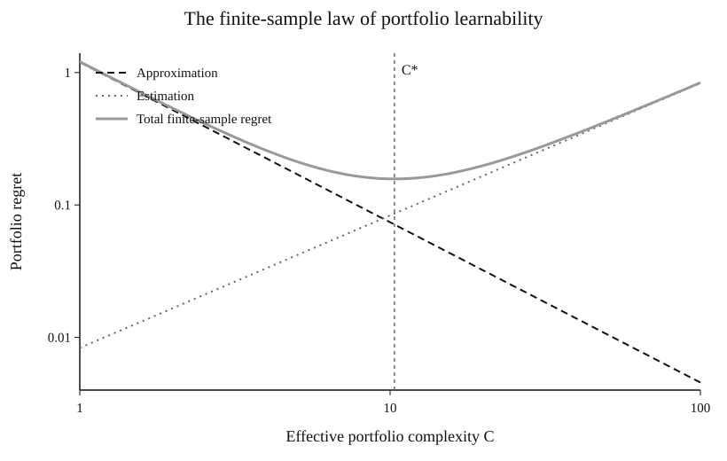
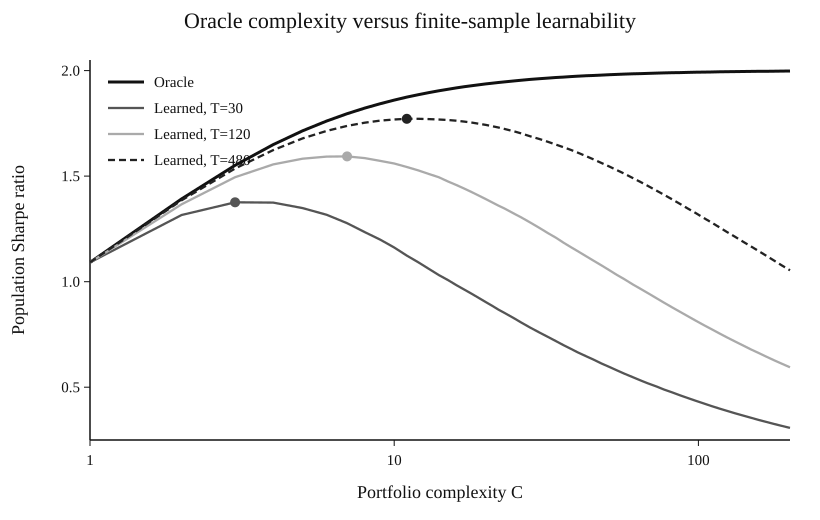
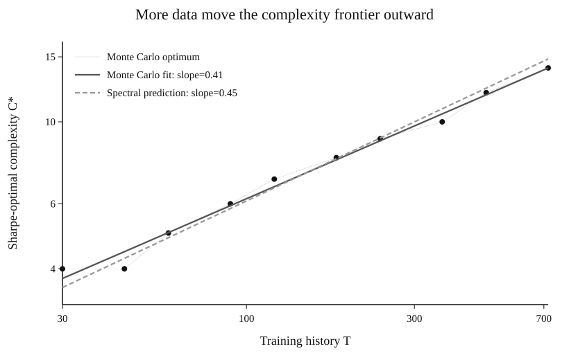
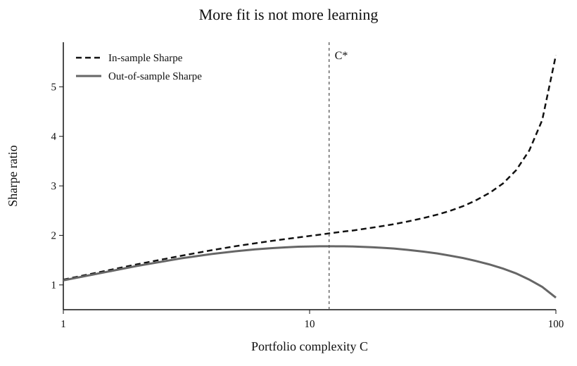
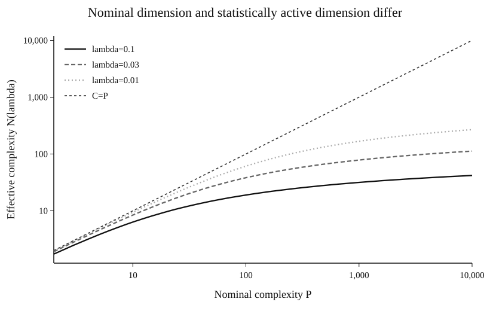

# Simulated portfolio-complexity figures

These figures are an illustrative Monte Carlo layer for the portfolio-learnability theory in the paper. The DGP is constructed directly in the **economic eigenbasis** with

\[
\mu_j \propto j^{-b},
\qquad
w_j^\star = \mu_j^{(r-1)/2} h_j,
\]

and nested spectral policy classes indexed by the number of economically active directions, \(C\). The design is deliberately transparent: approximation improves as more directions are admitted, while finite-sample estimation becomes harder.

The committed SVGs are lightweight GitHub previews. To regenerate publication-ready **PDF, PNG, and SVG** files, run from `monte_carlo/`:

```bash
python simulated_complexity_figures.py --quick
python simulated_complexity_figures.py --reps 2500
```

## 1. Finite-sample regret decomposition



The leading regret envelope separates into a falling approximation component and a rising estimation component. Their sum has a unique finite minimizer \(C_T^\star\).

## 2. Oracle versus learned Sharpe ratio



The oracle benefits monotonically from richer nested policy classes. The learned portfolio faces finite-sample estimation risk, so its Sharpe ratio peaks at an interior complexity. As the training history grows from \(T=30\) to \(T=480\), the peak moves outward.

**Interpretation:** this is Monte Carlo evidence for the economic mechanism, not a theorem that every DGP-specific Sharpe curve must be globally hump-shaped.

## 3. The complexity scaling law



The Sharpe-optimal complexity rises systematically with market history. In the current calibration, the fitted Monte Carlo log-log slope is about `0.41`, compared with a spectral prediction of about `0.45`. The underlying points are in `fig_sim_03_scaling_points.csv`.

## 4. In-sample fit versus out-of-sample learning



Nested classes keep improving in-sample Sharpe as complexity rises. Population out-of-sample Sharpe eventually deteriorates. The figure makes the distinction between **more fit** and **more learning** visible.

## 5. Nominal versus effective complexity



A very large nominal parameterization \(P\) need not imply a similarly large statistically active dimension. The relevant object for the paper is the effective dimension

\[
\mathcal N(\lambda)
=
\sum_j \frac{\mu_j}{\mu_j+\lambda},
\]

which can remain far below \(P\) even when the representation is extremely rich.

## Paper use

The natural main-text ordering is Figures 1--4. Figure 5 is especially useful when contrasting the paper's notion of effective portfolio complexity with raw parameter counts such as \(P/T\).
